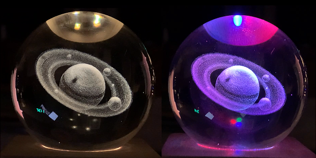
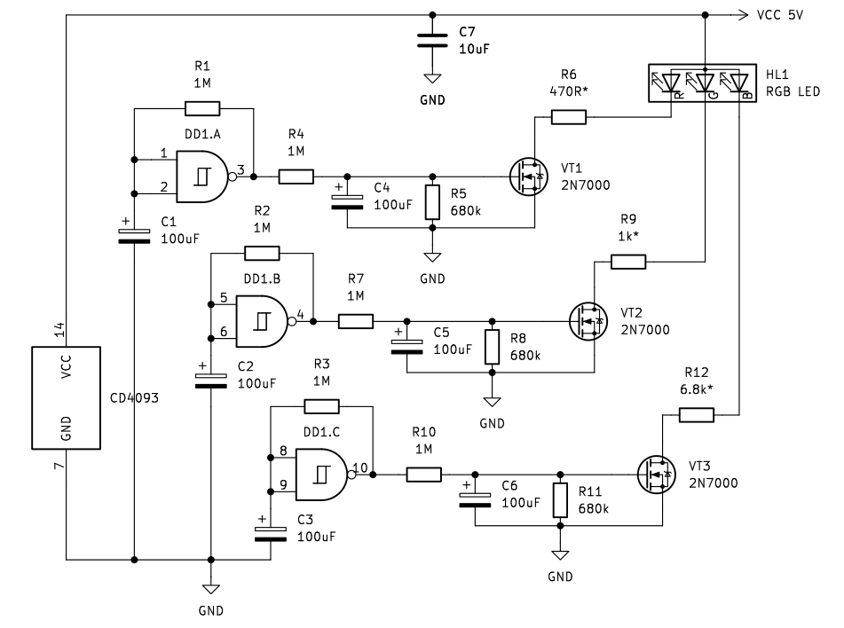
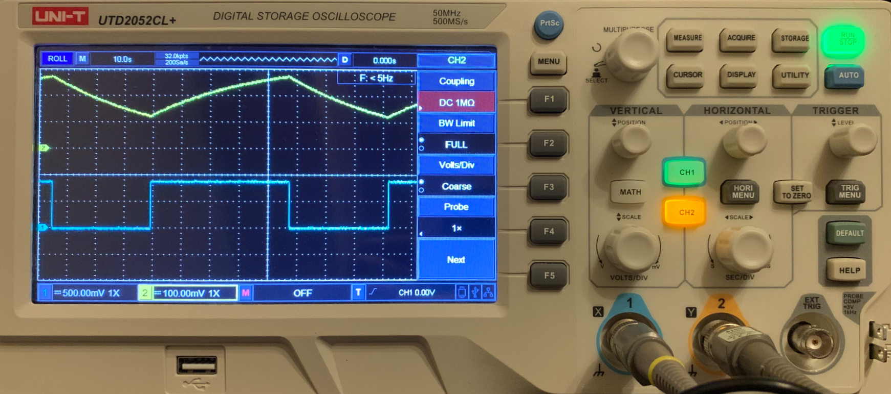
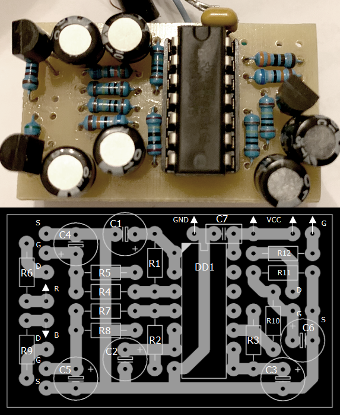

# Simple RGB nightlight

I bought a nightlight recently: a crystal ball with a laser engraved 3D image of Saturn and illuminated by super bright white SMD LEDs. It's a really nice thing, but after a while it got boring, so I decided to make it more attractive by replacing white leds with colored ones and adding smooth switch circuitary. Of course, last one could be done by using arduinos, AVR, PICs and so on, but I prefer analog circuitary 'cause it cheap and cheerful.

The simplest way to achieve the goal is to use 3 square wave oscillators on NAND logic. Attached delay elements R4C4R5, R7C5R8, R10C6R11 transform square wave to triangular, so voltage on MOSFET gates smoothly swings up and down accodring to periods setted by R1C1, R2C2, R3C3. 

Okay, let's dive into math behind the circuit (just skip this section if you're not a beginner).

Coarse tolerance of capacitors and resistors, parasitic capacitance between wires and temperature deviation leads to the fact that the time constant is slightly differs for each of 3 oscillators. After startup they gradually go out of synchronization and while voltage on gate of first MOSFET goes up, voltage on gate of another one goes down, so LEDs respectively lit up in a random order.

By Thevenin theorem we have $$\tau$$ (for R4C4R5 = R7C5R8 = R10C6R11):

$$
\begin{aligned}
\tau &= \frac{R_5R_4}{R_5 + R_4} \cdot C_4  \approx 40.5
\end{aligned}
$$

Now we need to calculate Schmitt trigger oscillation period (for R1C1 = R2C2 = R3C3):

$$
\begin{aligned}
T_S &= {R_1C_1 \cdot ln (\frac{V_C - V_1}{V_C - V_2} \cdot \frac{V_2}{V_1})} \approx 90.5
\end{aligned}
$$

where Vc = VCC = 5V, V1, V2 - threshold voltages (0.8V and 1.6V respectively).
You can notice exact the same period on a scope's 10s scale above.

The test circuit made on a tiny PCB board ($$\approx$$ 45x25mm) shown below:

Parts list:

DA1 = 4093;

VT1-VT3 = 2N7000;

C1-C6 = 100ufx16V;

C7 = 10ufx50V;

R1-R4, R7, R10 = 1M;

R5, R8, R11 = 680k;

R6 = 470R*;

R9 = 1k*;

R12 = 6.8k*;

* you need to pick the right one to adjust LED brightness.
